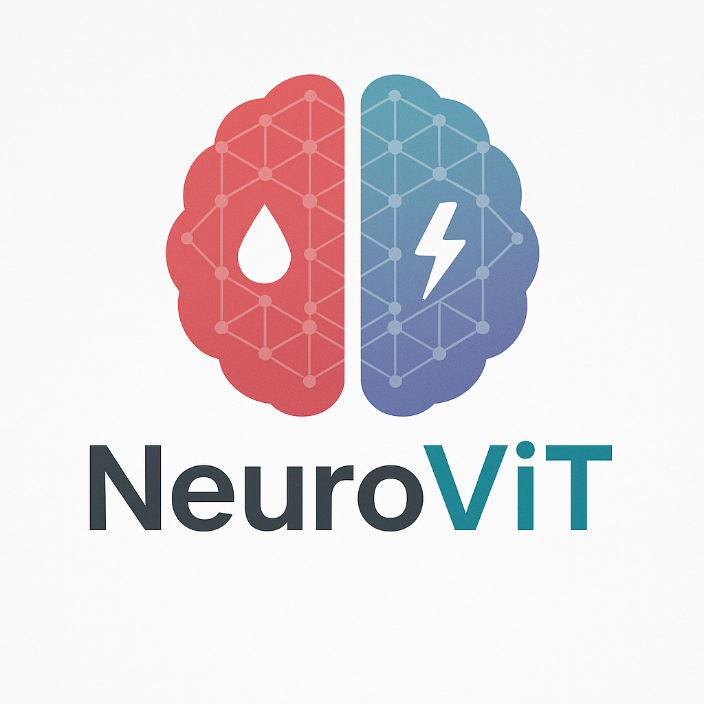

# NeuroViT: Brain Stroke Classification using Vision Transformers

A deep learning project comparing ResNet18 and Vision Transformer (ViT) models for binary classification of brain stroke CT scans.

## Project Description

This project implements two deep learning models to classify brain CT scans as:
- "inme var" (stroke present)
- "inme yok" (no stroke)

We compare:
1. **ResNet18** (CNN baseline)
2. **Vision Transformer (ViT)** (advanced model)

## Key Features

- Custom dataset loader for medical images
- Side-by-side model comparison
- Training and evaluation pipelines
- Performance metrics and visualization

## Dataset

The TEKNO21 Brain Stroke Dataset contains:
- 7,369 brain CT scans (DICOM/PNG)
- Expert-annotated labels
- Binary classification task

## Model Specifications

### ResNet18 (Baseline)
- Pretrained on ImageNet
- Modified final layer (512 → 2)
- AdamW optimizer (lr=1e-4)
- 25 training epochs

### Vision Transformer (Advanced)
- ViT-base-patch16-224 pretrained on ImageNet-21k
- Custom classification head (768 → 2)
- Differential learning rates:
  - Backbone: 5e-5
  - Head: 1e-4
- 30 training epochs

## Results

| Metric          | ResNet18 | ViT     |
|-----------------|---------|---------|
| Accuracy        | 96.74%  | 95.18%  |
| Precision       | 97.15%  | 95.50%  |
| Recall          | 96.07%  | 94.42%  |
| F1-Score        | 96.55%  | 94.89%  |

## Requirements

- Python 3.8+
- PyTorch
- HuggingFace Transformers
- Datasets library
- scikit-learn

## Getting Started

1. Clone this repository
2. Install requirements: `pip install -r requirements.txt`
3. Run the Jupyter notebook: `NeuroViT.ipynb`

## Future Work

- 3D ViT for volumetric analysis
- Multimodal integration (clinical data)
- Domain-specific pretraining

## License

This project is for research purposes only. Dataset use must comply with original data provider terms.

## Team

•    Engr. Muhammad Osama     •	Muhammad Moeez    •	Muneeb Ur Rahman
